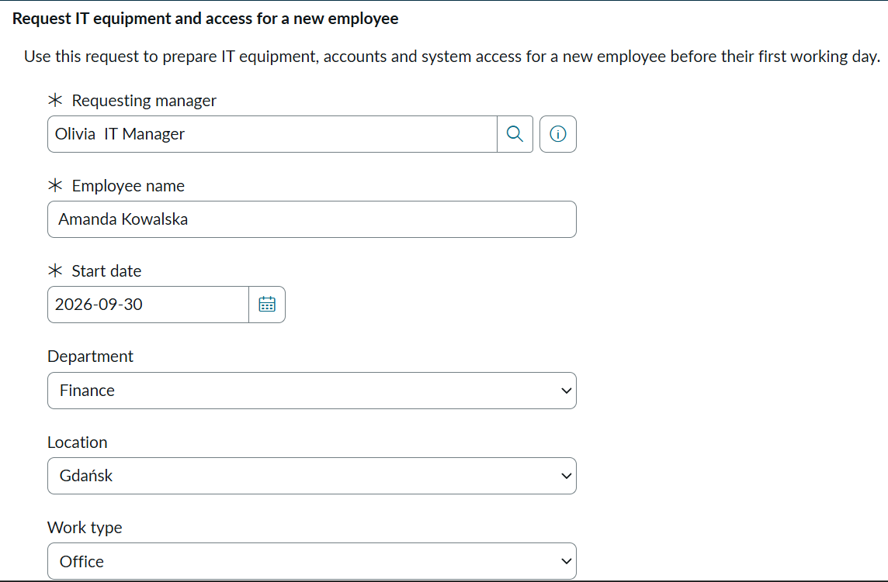
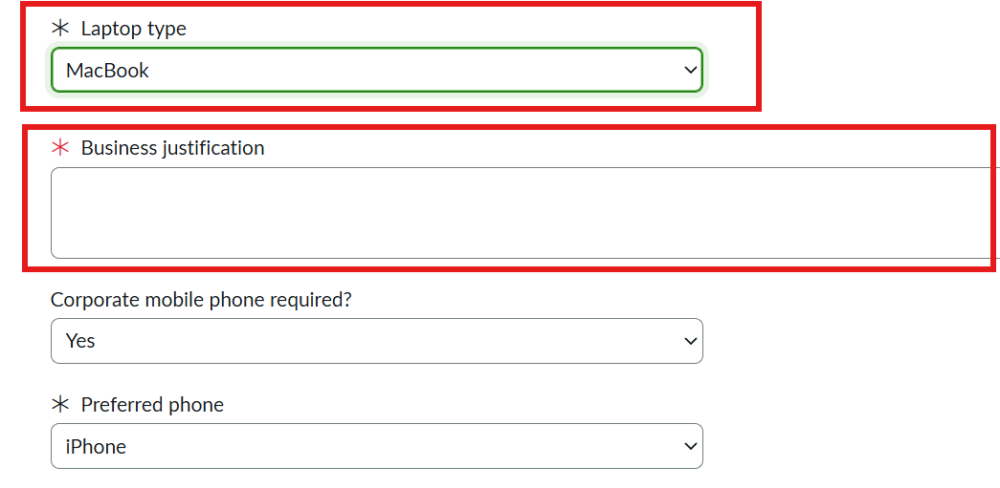
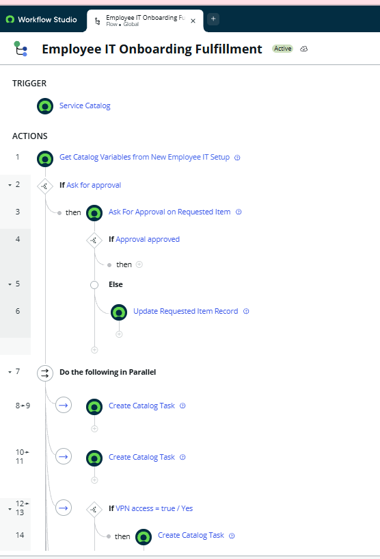
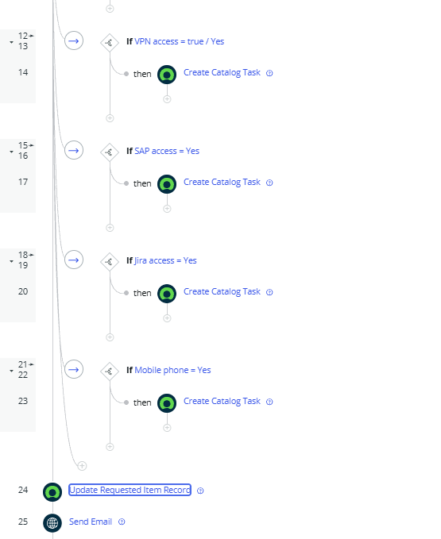
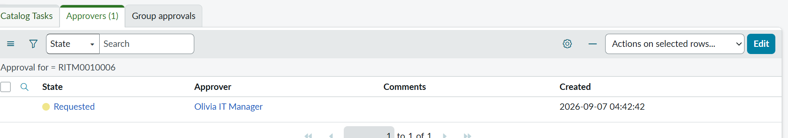
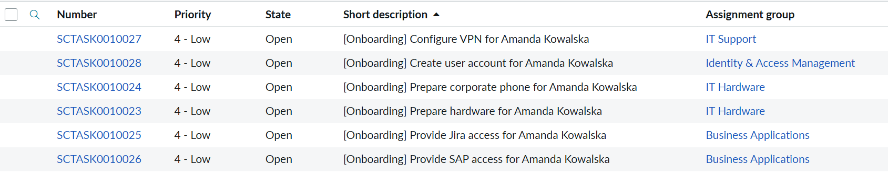
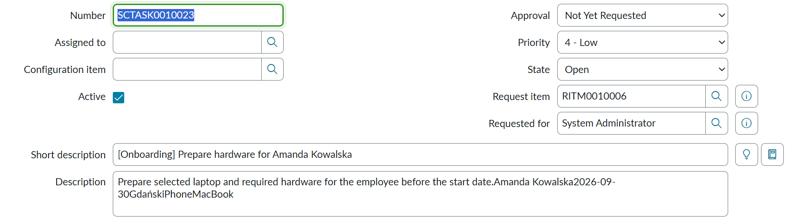
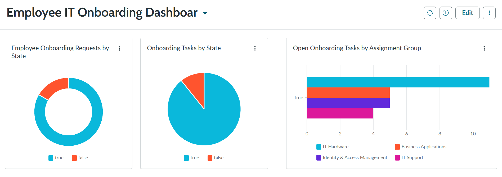
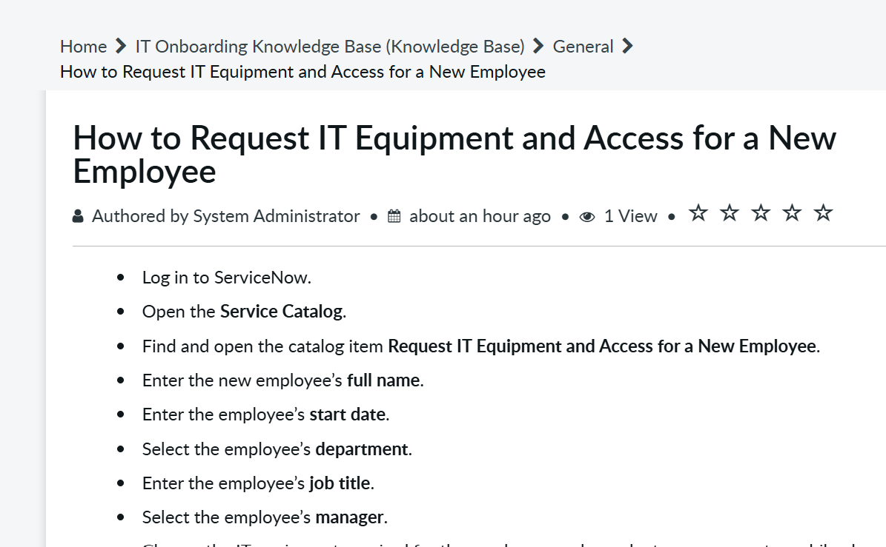

# ServiceNow Employee IT Onboarding

A hands-on ServiceNow portfolio project built in a **Personal Developer Instance (PDI)** as part of my preparation for the **ServiceNow Certified System Administrator (CSA)** certification.

The project demonstrates an end-to-end IT onboarding process for new employees — from submitting a Service Catalog request, through conditional approvals and automated fulfillment tasks, to SLA tracking, notifications, reporting, and Knowledge Management.

---

## Project Overview

New employee onboarding often requires coordination between multiple IT teams.

A manager may need to request:

- a laptop
- a corporate phone
- Microsoft 365
- VPN access
- SAP access
- Jira access
- additional software

The goal of this project was to create one centralized ServiceNow request that collects all required information and automatically routes work to the appropriate IT teams.

### Process

```text
Manager submits onboarding request
        |
        v
Dynamic form validation
        |
        v
Premium laptop required?
        |
   +----+----+
   |         |
  Yes        No
   |         |
   v         |
Manager      |
approval     |
   |         |
   v         |
Approved?    |
   |         |
+--+--+      |
|     |      |
Yes   No     |
|     |      |
|     v      |
|  Request   |
|  closed    |
|            |
+------>-----+
        |
        v
Fulfillment
        |
        v
Catalog Tasks created
        |
        v
IT teams complete tasks
        |
        v
SLA tracking
        |
        v
Request completed
        |
        v
Email notification
```

---

## Service Catalog

I created a custom Catalog Item called:

### New Employee IT Setup

The form collects the information required by IT teams to prepare equipment, accounts, and system access for a new employee.

The request includes variables such as:

- Employee name
- Start date
- Department
- Location
- Work type
- Laptop type
- Business justification
- Corporate mobile phone
- Microsoft 365
- VPN access
- SAP access
- Jira access
- Other software
- Additional comments
- Requesting manager



---

## Dynamic Form Behavior

Catalog UI Policies were configured to dynamically change the form depending on the user's selections.

For example, when a **MacBook** is selected, an additional **Business justification** field becomes visible and mandatory.

This keeps the form simple for standard requests while collecting additional information only when necessary.



Additional conditional behavior includes:

- requiring business justification for premium hardware
- showing phone-related options only when a corporate phone is requested
- adjusting required information depending on the employee's work setup
- supporting different request paths based on user selections

---

## Client-Side Validation

A **Catalog Client Script** was implemented to validate the employee start date.

The script prevents users from submitting an onboarding request with a start date in the past.

This provided hands-on experience with:

- Catalog Client Scripts
- JavaScript
- `g_form`
- client-side form validation
- Service Catalog user experience

---

## Workflow Automation

The onboarding process is automated using **Flow Designer / Workflow Studio**.

The flow retrieves values submitted through the Catalog Item and uses them to determine which actions should be performed.

The automation includes:

- Get Catalog Variables
- conditional logic
- approval routing
- automatic Catalog Task creation
- Assignment Groups
- request status updates
- email notifications
- Data Pills
- multiple fulfillment paths

### Approval Logic

The first part of the workflow checks whether the selected laptop requires additional approval.

Premium hardware such as a MacBook or Developer Laptop is routed through an approval process before fulfillment can continue.



### Fulfillment Logic

After the request passes the required approval logic, ServiceNow creates fulfillment tasks for the appropriate IT teams.

Conditional logic determines which additional tasks are required based on the options selected in the original request.



---

## Approval Process

Premium hardware requests require approval before fulfillment begins.

Approval is required when the employee requests:

- MacBook
- Developer Laptop

The request is routed to the designated IT Manager for approval.



The workflow handles both approval outcomes.

### Approved Request

```text
Premium laptop selected
        |
        v
Approval requested
        |
        v
Manager approves
        |
        v
Fulfillment continues
```

### Rejected Request

```text
Premium laptop selected
        |
        v
Approval requested
        |
        v
Manager rejects
        |
        v
Requested Item closed
as Closed Incomplete
        |
        v
Flow ends
```

This allowed me to practice both positive and negative workflow scenarios.

---

## Automated Catalog Tasks

After approval — or immediately for requests that do not require premium hardware approval — ServiceNow automatically creates fulfillment tasks for the appropriate IT teams.

Depending on the options selected in the original request, tasks can include:

- Prepare hardware
- Create user account
- Configure Microsoft 365
- Configure VPN
- Provide SAP access
- Provide Jira access
- Prepare corporate mobile phone



The tasks are automatically assigned to the appropriate Assignment Groups.

| Assignment Group | Responsibility |
|---|---|
| IT Hardware | Laptop and mobile device preparation |
| Identity & Access Management | User account and identity setup |
| IT Support | VPN and general IT configuration |
| Business Applications | SAP and Jira access |

This demonstrates automatic task routing based on information provided in the original Service Catalog request.

---

## Catalog Task Example

Each Catalog Task contains the information required by the fulfillment team.

Data entered in the original Service Catalog request is passed to downstream tasks using **Flow Designer Data Pills**.

For example, the Hardware team can receive information such as:

- Employee name
- Start date
- Location
- Laptop type
- mobile phone requirements



This allows fulfillment teams to perform their work without manually searching for information in the original request.

---

## SLA Management

An SLA was configured for onboarding fulfillment tasks.

Example SLA:

### Employee Onboarding Task – 8 Hours

The SLA is used to track the time required to complete onboarding-related Catalog Tasks.

This part of the project provided hands-on experience with:

- SLA Definitions
- Task SLA records
- start conditions
- stop conditions
- SLA duration
- SLA monitoring
- fulfillment performance tracking

---

## Reporting and Dashboard

A dashboard was created to provide visibility into the IT onboarding process.

The dashboard can be used to monitor:

- open onboarding tasks
- completed tasks
- workload by Assignment Group
- task status
- SLA performance
- breached SLAs



The goal was to provide IT teams with a simple operational overview of the current onboarding workload.

---

## Knowledge Management

I also created a Knowledge Article to support managers using the onboarding process.

Example article:

### How to Request IT Equipment and Access for a New Employee

The article explains how to submit the onboarding request and what information should be prepared before creating it.



This part of the project provided additional hands-on experience with **ServiceNow Knowledge Management** and self-service support.

---

## Testing Scenarios

The solution was tested using multiple onboarding scenarios to verify both the standard process and alternative workflow paths.

### Scenario 1 — Standard Laptop

```text
Standard Windows Laptop selected
        |
        v
No premium hardware approval required
        |
        v
Fulfillment starts
        |
        v
Catalog Tasks created
```

### Scenario 2 — MacBook Approved

```text
MacBook selected
        |
        v
Manager approval requested
        |
        v
Approved
        |
        v
Fulfillment tasks created
```

### Scenario 3 — MacBook Rejected

```text
MacBook selected
        |
        v
Manager approval requested
        |
        v
Rejected
        |
        v
Requested Item closed
as Closed Incomplete
        |
        v
Fulfillment does not continue
```

### Scenario 4 — Remote Employee

```text
Work type: Remote
        |
        v
VPN access required
        |
        v
VPN Catalog Task created
        |
        v
Assigned to IT Support
```

### Scenario 5 — SAP Access

```text
SAP access requested
        |
        v
SAP Catalog Task created
        |
        v
Assigned to Business Applications
```

### Scenario 6 — Corporate Phone

```text
Corporate phone requested
        |
        v
Additional phone options displayed
        |
        v
Hardware fulfillment includes
phone preparation
```

### Scenario 7 — Invalid Start Date

```text
Start date in the past
        |
        v
Client-side validation triggered
        |
        v
Request cannot be submitted
```

---

## ServiceNow Features Used

This project includes practical experience with:

- Service Catalog
- Catalog Items
- Catalog Variables
- Reference Variables
- Catalog UI Policies
- Catalog UI Policy Actions
- Catalog Client Scripts
- JavaScript
- Users
- Groups
- Assignment Groups
- Requests — REQ
- Requested Items — RITM
- Catalog Tasks — SCTASK
- Flow Designer
- Workflow Studio
- Service Catalog Trigger
- Get Catalog Variables
- Data Pills
- Flow Logic
- Conditional Logic
- Approvals
- Approval rejection paths
- Create Catalog Task
- Update Record
- Email Notifications
- SLA Management
- Task SLA
- Reporting
- Dashboards
- Knowledge Management
- User Impersonation
- Testing and troubleshooting

---

## Request Fulfillment Structure

One of the key concepts practiced during this project was the relationship between ServiceNow request records:

```text
REQ
 |
 +-- RITM
      |
      +-- SCTASK - Hardware
      |
      +-- SCTASK - Identity & Access
      |
      +-- SCTASK - VPN
      |
      +-- SCTASK - SAP
      |
      +-- SCTASK - Mobile Phone
```

This helped me better understand how ServiceNow coordinates a single user request across multiple fulfillment teams.

---

## What I Learned

This project gave me practical experience designing and configuring an end-to-end business process in ServiceNow.

I learned how different parts of the platform work together — starting with the Service Catalog and user-facing forms, through workflow automation and approvals, to fulfillment tasks, SLA tracking, Knowledge Management, and reporting.

The project also helped me better understand:

- how REQ, RITM, and SCTASK records relate to each other
- how Catalog Variables can be used inside Flow Designer
- how Data Pills transfer information between workflow actions
- how approval logic controls fulfillment
- how tasks can be dynamically created based on user selections
- how Assignment Groups are used to distribute work
- how ServiceNow supports end-to-end IT service processes
- how to test multiple workflow scenarios using test users and impersonation

---

## Project Context

This project was created independently in a **ServiceNow Personal Developer Instance (PDI)** while preparing for the **ServiceNow Certified System Administrator (CSA)** certification.

It was designed as a hands-on portfolio project to apply ServiceNow concepts in a realistic IT Service Management scenario.

The objective was not only to practice individual ServiceNow features, but to combine them into one complete business process similar to workflows used in real organizations.

---

## Skills Demonstrated

`ServiceNow` `ITSM` `Service Catalog` `Flow Designer` `Workflow Studio` `JavaScript` `Catalog Client Scripts` `UI Policies` `Approvals` `Catalog Tasks` `Assignment Groups` `SLA Management` `Knowledge Management` `Reporting` `Dashboards` `Workflow Automation`

